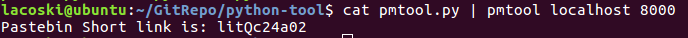

# Triển khai Project tại local
---
## 1. Tổ chức thư mục
- `docs` : Tài liệu tham khảo
- `pasteme` : Project (django 2.x)
- `requirements` : Các gói cần thiết để chạy Project
- `template-sample` : Template sử dụng cho Project
- `tool-client` : Tool client (Linux)

## 2. Triển khai Project
> Trên Ubuntu 16.04

### 2.1 Các gói cần thiết
> pip3, python3, mysql

> requirements/local.txt

__Cài đặt mysql__
> Yêu cầu tạo db: pasteme

Tham khảo : https://github.com/lacoski/mysql-1

__Cài đặt python-pip__
```bash
sudo apt-get install python-pip
```

__Cài đặt python venv__

Tham khảo : https://github.com/lacoski/python-venv

__Cài đặt gói phụ thuộc__
```
pip3 install -r requirements/local.txt
```

### 2.2 Thiết lập Project

__Thiết lập kết nối db__

- Cấu hình settings.py [`pasteme/pasteme/setting.py`]

```py
DATABASES = {
#    'default': {
#        'ENGINE': 'django.db.backends.sqlite3',
#        'NAME': os.path.join(BASE_DIR, 'db.sqlite3'),
#    }
    'default': {
        'ENGINE': 'django.db.backends.mysql',
        'NAME': 'pasteme',
        'USER': '[user]',
        'PASSWORD': '[password user]',
        'HOST': '[ip host]',   # Or an IP Address that your DB is hosted on
        'PORT': '3306',
    }
}
```

__Migrations model tới db mysql__
- Truy cập project [`pasteme/`]

```
python3 manage.py makemigrations

python3 manage.py migrate
```

__Chạy project__
```
python3 manage.py runserver
```

__Tạo superuser django admin__
```
python manage.py createsuperuser
```

__Truy cập web__
```
localhost:8000
```

### 2.3 Thiết lập tool
> tool trong thư mục `tool-client/linux/pmtool.py`

__Cài đặt tool__
```
sudo cp pmtool.py /usr/local/bin/pmtool
```

__Cấu trúc__
```
cat [file] | pmtool [host] [port]
```

VD:


