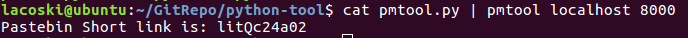
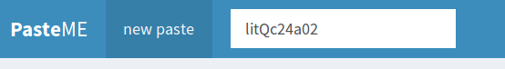
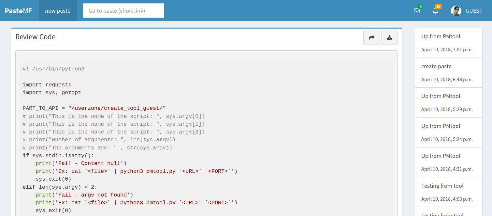

# PasteME (share paste) - Opensource
---
## Tổng quan

PasteME là một website cho phép người dùng lưu trữ các mẫu văn bản thô và chia sẻ nó với mọi người. Cho phép hiện thị code thân thiện với nhiều định dạng hỗ trợ

> Apache, Bash,C#, C++, CSS, CoffeeScript, Diff, HTML, XML, HTTP, Ini, JSON, Java, JavaScript, Makefile, Markdown, Nginx, Objective-C, PHP, Perl, Python, Ruby  SQL, Shell Session

PasteMe được xây dựng dựa trên:
- `Django 2.0.2`

Hỗ trợ database:
- `mysql`
- `sqlite3`

Web: http://paste.hocchudong.com/

## Hình ảnh minh họa
### Trang chủ

> Trang chủ

### Review code

> Review code

### Trang quản lý Paste

> Trang cá nhân User

### Tool client

> Tool tại client (Linux)

## Triển khai Project

### [Triển khai Project tại local](docs/setup-project.md)

### [Triển khai Project production](docs/development-production.md)
