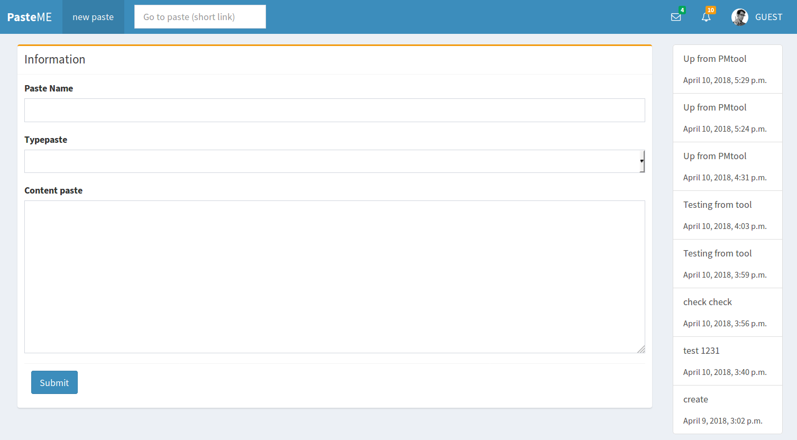
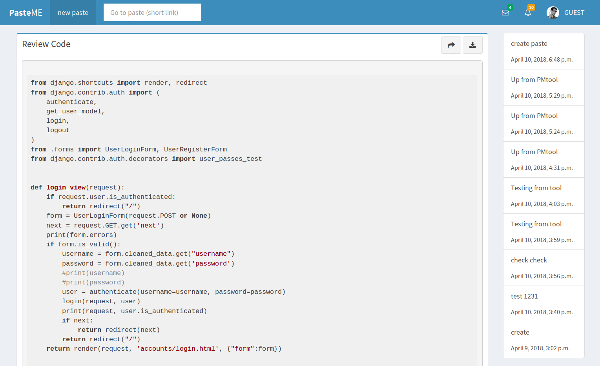
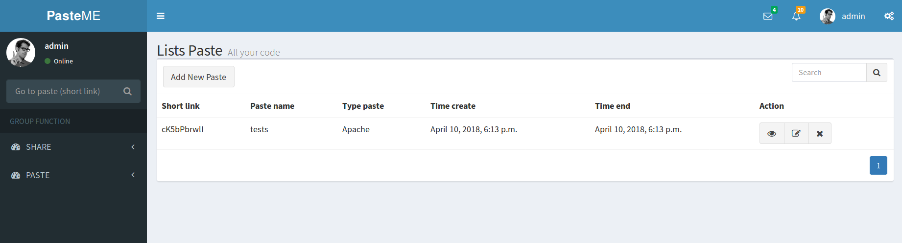

# PasteME (share paste)
---
## Tổng quan

PasteME là một website cho phép người dùng lưu trữ các mẫu văn bản thô và chia sẻ nó với mọi người. Cho phép hiện thị code thân thiện với nhiều định dạng hỗ trợ

> Apache, Bash,C#, C++, CSS, CoffeeScript, Diff, HTML, XML, HTTP, Ini, JSON, Java, JavaScript, Makefile, Markdown, Nginx, Objective-C, PHP, Perl, Python, Ruby  SQL, Shell Session

## Hình ảnh minh họa

> Trang chủ

> Review code

> Trang cá nhân User

## Cài đặt, cấu trúc Project

(Đang chuẩn bị)
